# OpenBao UI-First Guide for Beginners
## Users, Policies, Machine Access, Secret Management, and OpenBao Agent

> This guide is written for people with **zero prior OpenBao knowledge**.
>
> It is **UI-first**:
> - Use the **OpenBao Web UI** wherever possible
> - Use the **OpenBao Browser CLI in the Web UI** only for:
>   - creating an AppRole role
>   - reading the `role_id`
>   - generating the `secret_id`
>
> This guide also shows how to move an app from a local `.env` file to:
>
> **OpenBao + AppRole + OpenBao Agent + template-rendered `.env`**

---

## Table of Contents

1. [What OpenBao is](#what-openbao-is)
2. [Simple words you need to know](#simple-words-you-need-to-know)
3. [What we are building](#what-we-are-building)
4. [Recommended design](#recommended-design)
5. [Part 1 - First login and admin basics](#part-1---first-login-and-admin-basics)
6. [Part 2 - Create a normal human user in the UI](#part-2---create-a-normal-human-user-in-the-ui)
7. [Part 3 - Create policies](#part-3---create-policies)
8. [Part 4 - Create the secrets engine in the UI](#part-4---create-the-secrets-engine-in-the-ui)
9. [Part 5 - Store app secrets in the UI](#part-5---store-app-secrets-in-the-ui)
10. [Part 6 - Create an AppRole with the Web UI Browser CLI](#part-6---create-an-approle-with-the-web-ui-browser-cli)
11. [Part 7 - Test machine access](#part-7---test-machine-access)
12. [Part 8 - Install OpenBao Agent on the app server](#part-8---install-openbao-agent-on-the-app-server)
13. [Part 9 - Configure Agent to render a generic `.env`](#part-9---configure-agent-to-render-a-generic-env)
14. [Part 10 - Configure systemd](#part-10---configure-systemd)
15. [Part 11 - Day-to-day secret management](#part-11---day-to-day-secret-management)
16. [Part 12 - Add another app](#part-12---add-another-app)
17. [Troubleshooting](#troubleshooting)
18. [Security best practices](#security-best-practices)
19. [Quick reference](#quick-reference)

---

## What OpenBao is

OpenBao is a central place to store secrets.

Instead of keeping sensitive values in many local `.env` files on many servers, you keep them in OpenBao and let users or apps fetch them securely.

Examples of secrets:

- database passwords
- API keys
- client secrets
- Flask `SECRET_KEY`
- `CLIENT_ID`
- `CLIENT_SECRET`
- URLs, tokens, and app env values

---

## Simple words you need to know

### Secret
A sensitive value.

Example:

```text
CLIENT_SECRET=abc123
```

### Secret path
Where the secret lives in OpenBao.

Example:

```text
apps/flask-keycloak
```

Think of it like a secure file location.

### Auth method
The login method.

Examples:

- **Username & Password** for people
- **AppRole** for apps/machines

### Policy
The permission rule.

It answers:

- what can this user do?
- what can this app do?
- which path can it access?

### Token
The access badge OpenBao gives after login.

### AppRole
A machine/app identity.

It uses:

- `role_id` = app username
- `secret_id` = app password

### OpenBao Agent
A helper process on the app server that:

- logs in to OpenBao
- renews tokens
- reads secrets
- renders them into files such as `.env`

---

## What we are building

For one Flask app, we want this:

```text
OpenBao UI
  ->
secret path: apps/flask-keycloak
  ->
policy: flask-app-read
  ->
AppRole: flask-keycloak-role
  ->
OpenBao Agent on app server
  ->
rendered file: /opt/flask-app/.env
  ->
Flask app reads the file
```

For human admins, we want this:

```text
Username & Password user
  ->
policy attached to that user
  ->
OpenBao UI access
```

---

## Recommended design

Use this rule:

### For people
- one human user per person
- use **Username & Password**
- assign only the access they need

### For apps
- one app = one secret path
- one app = one policy
- one app = one AppRole
- one app server = one Agent config

### Example
For a Flask app:

- secret path: `apps/flask-keycloak`
- policy: `flask-app-read`
- AppRole: `flask-keycloak-role`

For another app:

- secret path: `apps/billing-api`
- policy: `billing-app-read`
- AppRole: `billing-api-role`

---

# Part 1 - First login and admin basics

## Step 1. Log in to OpenBao

Use the initial admin/root token only for first setup.

### UI steps
1. Open the OpenBao Web UI
2. Select the default namespace if needed
3. Sign in with the root/admin token

> Do **not** use the root token for daily work if you can avoid it.


### Screenshot

<p align="center">
  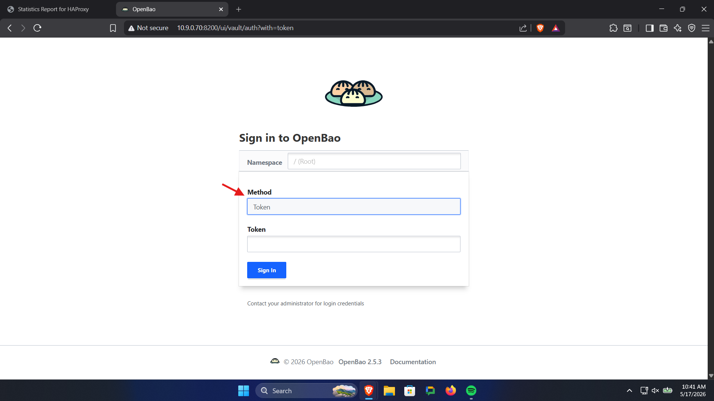
</p>

<p align="center">
  <b>OpenBao login screen with token login selected</b>
</p>

---

# Part 2 - Create a normal human user in the UI

Use **Username & Password** for human access.

## Step 2. Enable Username & Password auth

### UI steps
1. Go to **Access**
2. Open **Authentication methods**
3. Click **Enable an Authentication Method**
4. Select **Username & Password**
5. Keep the default path if you want
6. Save

### Screenshot

<p align="center">
  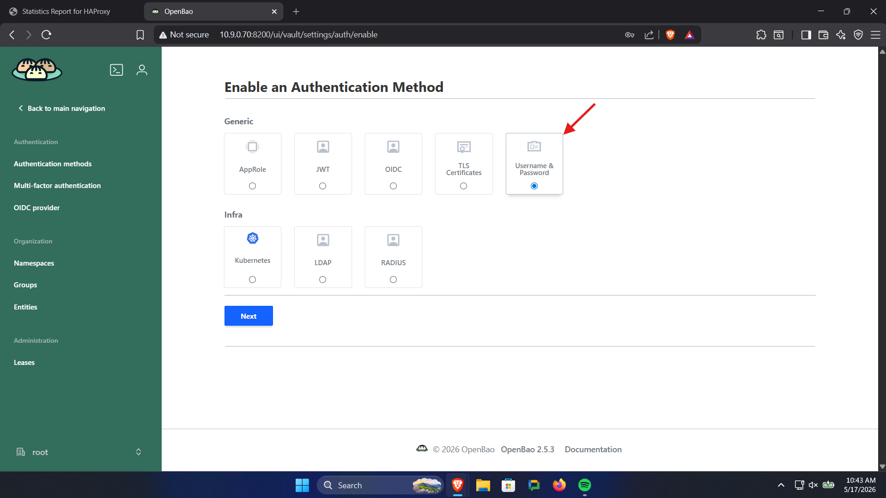
</p>

<p align="center">
  <b>Enable Username & Password authentication method</b>
</p>

## Step 3. Create a policy for human secret management

We will create a human policy named:

```text
apps-manager
```

This policy will allow a user to manage secrets under the `apps/` mount.

### Policy content

```hcl
path "apps/data/*" {
  capabilities = ["create", "read", "update", "patch", "delete"]
}

path "apps/metadata/*" {
  capabilities = ["read", "list"]
}
```

### UI steps
1. Go to **Policies**
2. Click **Create policy**
3. Name it `apps-manager`
4. Paste the policy text
5. Save

### Screenshot

<p align="center">
  
</p>

<p align="center">
  <b>Create apps-manager policy</b>
</p>

## Step 4. Create the human user

Example username:

```text
rafi
```

### UI steps
1. Go to **Access**
2. Open **Authentication methods**
3. Open the **Username & Password** method
4. Open **Users**
5. Click **Create user**
6. Set:
   - username: `rafi`
   - password: choose a strong password
7. Expand the **Tokens** section
8. In **Generated Token's Policies**, add:

```text
apps-manager
```

9. Save

### Screenshots

<p align="center">
  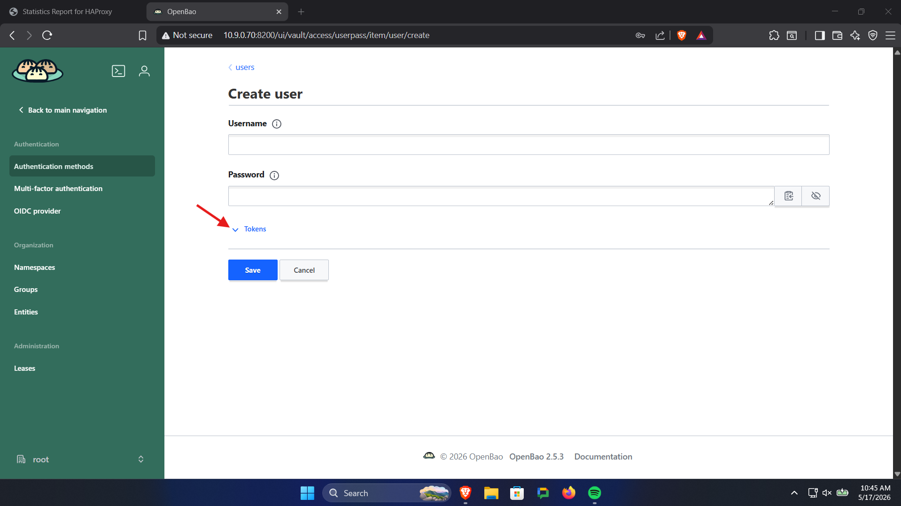
</p>

<p align="center">
  <b>Create human user</b>
</p>

<p align="center">
  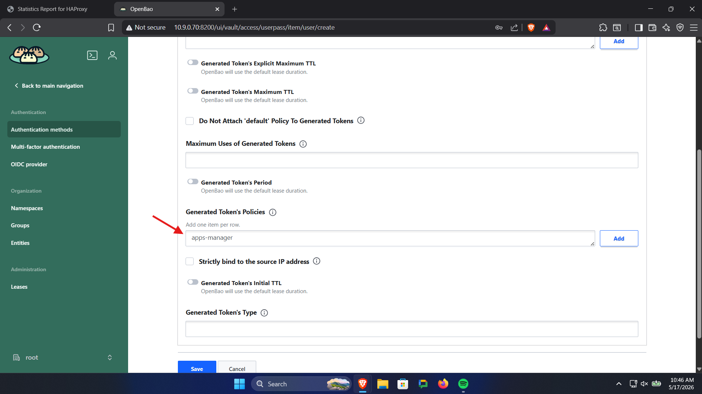
</p>

<p align="center">
  <b>Add apps-manager policy to the generated token policies</b>
</p>

## Step 5. Test the human user

### UI steps
1. Log out
2. Log back in using **Username & Password**
3. Use the user you created

If login works, your normal human access is ready.

---

# Part 3 - Create policies

Policies decide what users and apps can do.

## 3.1 Human admin policy example

Example policy name:

```text
apps-manager
```

### Policy

```hcl
path "apps/data/*" {
  capabilities = ["create", "read", "update", "patch", "delete"]
}

path "apps/metadata/*" {
  capabilities = ["read", "list"]
}
```

## 3.2 Machine read-only policy example

Example policy name:

```text
flask-app-read
```

### Policy

```hcl
path "apps/data/flask-keycloak" {
  capabilities = ["read"]
}

path "apps/metadata/flask-keycloak" {
  capabilities = ["read"]
}
```

### UI steps
1. Go to **Policies**
2. Click **Create policy**
3. Name it `flask-app-read`
4. Paste the policy
5. Save

### Screenshot

<p align="center">
  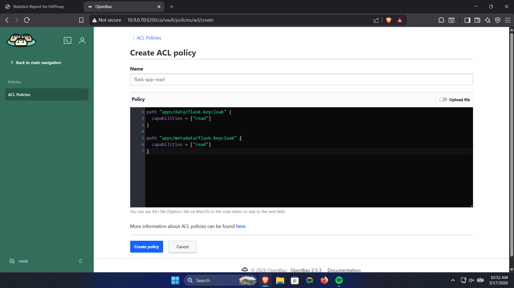
</p>

<p align="center">
  <b>Create flask-app-read policy</b>
</p>

---

# Part 4 - Create the secrets engine in the UI

We will create a KV v2 secrets engine named:

```text
apps
```

## Step 6. Enable the secrets engine

### UI steps
1. Go to **Secrets engines**
2. Click **Enable new engine**
3. Choose **KV**
4. Choose **Version 2**
5. Set the path to:

```text
apps
```

6. Save

### Screenshot

<p align="center">
  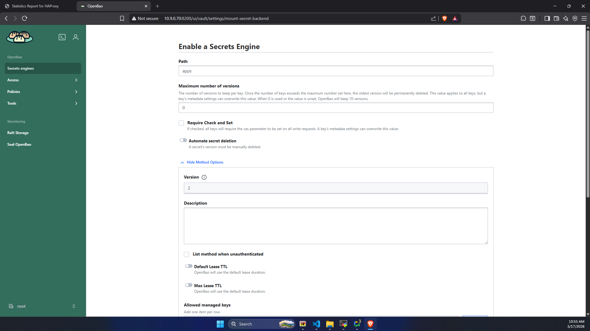
</p>

<p align="center">
  <b>Enable KV version 2 secrets engine at apps path</b>
</p>

---

# Part 5 - Store app secrets in the UI

We will store the Flask app values at:

```text
apps/flask-keycloak
```

## Step 7. Create the app secret

### UI steps
1. Go to **Secrets engines**
2. Open `apps/`
3. Click **Create secret**
4. Use path:

```text
flask-keycloak
```

5. Add keys and values

### Example keys

```json
{
  "SECRET_KEY": "your_very_secret_random_string_here",
  "DEBUG": "True",
  "KEYCLOAK_URL": "http://10.9.0.71",
  "REALM_NAME": "electronic-shop",
  "CLIENT_ID": "flask-app",
  "CLIENT_SECRET": "your-client-secret"
}
```

6. Save

### Screenshots

<p align="center">
  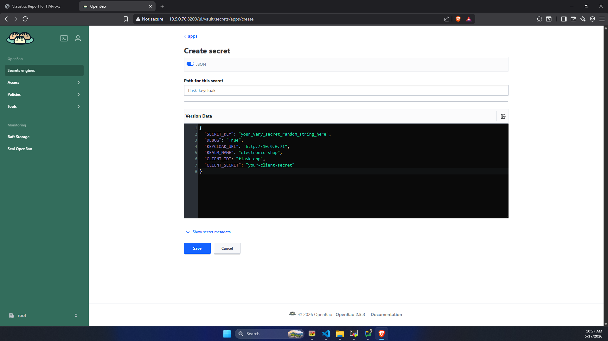
</p>

<p align="center">
  <b>Create flask-keycloak secret under apps secrets engine</b>
</p>

---

# Part 6 - Create an AppRole with the Web UI Browser CLI

This is the only part where we will use CLI.

## Step 8. Enable AppRole in the UI

### UI steps
1. Go to **Access**
2. Open **Authentication methods**
3. Click **Enable an Authentication Method**
4. Select **AppRole**
5. Keep the default path:

```text
approle
```

6. Save

### Screenshot

<p align="center">
  
</p>

<p align="center">
  <b>Enable AppRole authentication method</b>
</p>

## Step 9. Open the Browser CLI

In the Web UI, open the built-in CLI panel.

### Screenshot

<p align="center">
  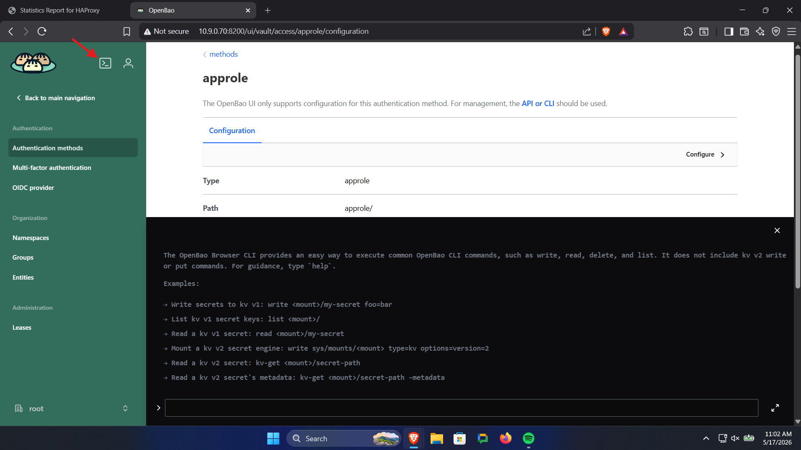
</p>

<p align="center">
  <b>OpenBao Browser CLI panel</b>
</p>

## Step 10. Create the AppRole

Use this command in the Web UI Browser CLI:

```bash
bao write auth/approle/role/flask-keycloak-role token_policies="flask-app-read"
```

## Step 11. Read the `role_id`

```bash
bao read auth/approle/role/flask-keycloak-role/role-id
```

## Step 12. Generate the `secret_id`

```bash
bao write -f auth/approle/role/flask-keycloak-role/secret-id
```

### Screenshots

<p align="center">
  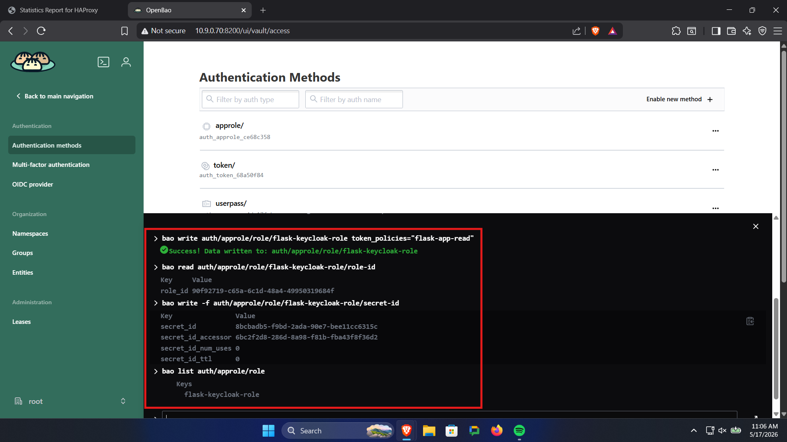
</p>

<p align="center">
  <b>Create AppRole using Browser CLI</b>
</p>

<p align="center">
  
</p>

<p align="center">
  <b>Read AppRole role_id</b>
</p>

<p align="center">
  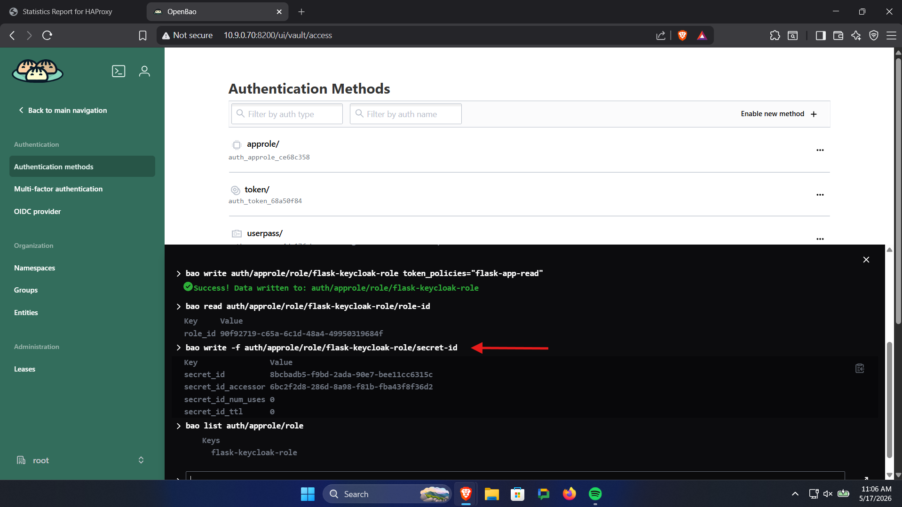
</p>

<p align="center">
  <b>Generate AppRole secret_id</b>
</p>

## Step 13. Optional: list AppRoles

```bash
bao list auth/approle/role
```

## Step 14. Optional: inspect one AppRole

```bash
bao read auth/approle/role/flask-keycloak-role
```

---

# Part 7 - Test machine access

## Step 15. Log in as the app

Use the Browser CLI or a normal terminal:

```bash
bao write auth/approle/login   role_id="YOUR_ROLE_ID"   secret_id="YOUR_SECRET_ID"
```

This returns a `client_token`.

## Step 16. Test reading the secret
**(After installing OpenBao Agent in a linux machine part 8 Step 17)**

With a full terminal CLI: 

```bash
export BAO_ADDR="http://10.9.0.70:8200"
export BAO_TOKEN="YOUR_CLIENT_TOKEN"

bao kv get -mount=apps flask-keycloak
```

If the read works, the machine identity is working correctly.

### Screenshot

<p align="center">
  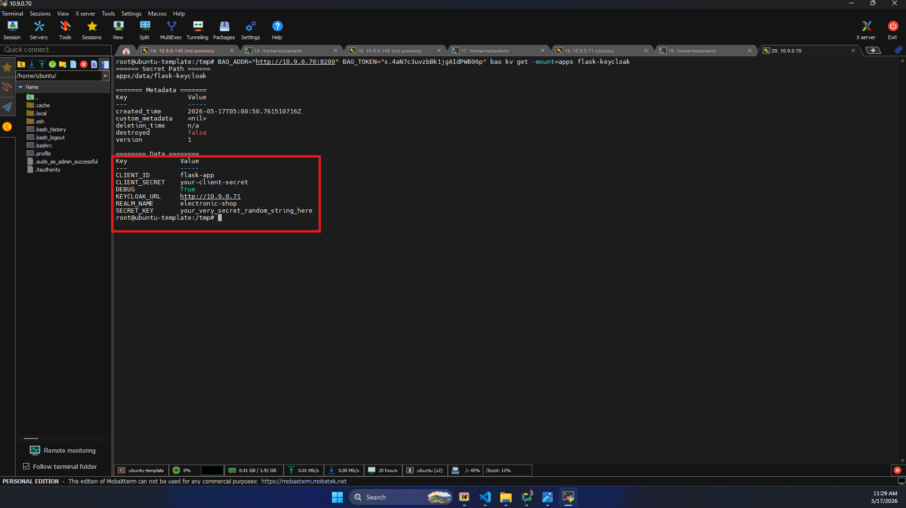
</p>

<p align="center">
  <b>OpenBao Agent running successfully</b>
</p>

---

# Part 8 - Install OpenBao Agent on the app server

## Step 17. Install the `bao` binary

On the app server:

```bash
cd /tmp

VERSION="2.5.0"
wget "https://github.com/openbao/openbao/releases/download/v${VERSION}/bao_${VERSION}_linux_x86_64.tar.gz"

tar -xzf "bao_${VERSION}_linux_x86_64.tar.gz"

sudo mv bao /usr/local/bin/bao
sudo chmod 755 /usr/local/bin/bao
```

Verify:

```bash
which bao
bao -h
bao version
```

## Step 18. Create Agent directories

```bash
sudo mkdir -p /etc/openbao-agent.d/approle
sudo mkdir -p /run/openbao-agent

sudo chmod 700 /etc/openbao-agent.d
sudo chmod 700 /etc/openbao-agent.d/approle
```

## Step 19. Save AppRole credentials in files

Create:

```bash
sudo tee /etc/openbao-agent.d/approle/role_id >/dev/null <<'EOF'
YOUR_ROLE_ID_HERE
EOF
```

Create:

```bash
sudo tee /etc/openbao-agent.d/approle/secret_id >/dev/null <<'EOF'
YOUR_SECRET_ID_HERE
EOF
```

Permissions:

```bash
sudo chmod 600 /etc/openbao-agent.d/approle/role_id
sudo chmod 600 /etc/openbao-agent.d/approle/secret_id
```

---

# Part 9 - Configure Agent to render a generic `.env`

## Step 20. Create the generic template

Create:

```bash
sudo tee /etc/openbao-agent.d/flask.env.ctmpl >/dev/null <<'EOF'
{{- with secret "apps/flask-keycloak" -}}
{{- range $k, $v := .Data.data }}
{{ $k }}={{ $v }}
{{- end }}
{{- end }}
EOF

sudo chmod 600 /etc/openbao-agent.d/flask.env.ctmpl
```

## Step 21. Create the Agent config

Create:

```bash
sudo tee /etc/openbao-agent.d/agent.hcl >/dev/null <<'EOF'
pid_file = "/run/openbao-agent/agent.pid"

vault {
  address = "http://10.9.0.70:8200"
}

auto_auth {
  method {
    type       = "approle"
    mount_path = "auth/approle"

    config = {
      role_id_file_path                   = "/etc/openbao-agent.d/approle/role_id"
      secret_id_file_path                 = "/etc/openbao-agent.d/approle/secret_id"
      remove_secret_id_file_after_reading = false
    }
  }

  sink {
    type = "file"
    config = {
      path = "/run/openbao-agent/token"
    }
  }
}

template_config {
  exit_on_retry_failure         = true
  static_secret_render_interval = "1m"
}

template {
  source               = "/etc/openbao-agent.d/flask.env.ctmpl" -------------> Change according to code base
  destination          = "/opt/flask-app/.env" -------------------------> .env file location in the code base
  create_dest_dirs     = true
  error_on_missing_key = true
}
EOF

sudo chmod 600 /etc/openbao-agent.d/agent.hcl
```

---

# Part 10 - Configure systemd

## Step 22. Create `openbao-agent.service`

Create:

```bash
sudo tee /etc/systemd/system/openbao-agent.service >/dev/null <<'EOF'
[Unit]
Description=OpenBao Agent
After=network-online.target
Wants=network-online.target

[Service]
Type=simple
Environment=HOME=/root
ExecStart=/usr/local/bin/bao agent -config=/etc/openbao-agent.d/agent.hcl
Restart=always
RestartSec=5

[Install]
WantedBy=multi-user.target
EOF
```


## Step 23. Reload and start services

```bash
sudo systemctl daemon-reload

sudo systemctl enable openbao-agent.service

sudo systemctl start openbao-agent.service
```

## Step 24. Verify

Check Agent:

```bash
sudo systemctl status openbao-agent.service --no-pager
sudo journalctl -u openbao-agent.service -n 50 --no-pager
```


Check rendered `.env`:

```bash
sudo ls -l /opt/flask-app/.env
sudo cat /opt/flask-app/.env
```


---

# Part 11 - Day-to-day secret management

Once setup is complete, your daily work should be almost entirely in the **OpenBao UI**.

## Change a value

### UI steps
1. Open `apps/flask-keycloak`
2. Edit a key
3. Save

Result:
- Agent re-renders `.env`


## Add a new variable

### UI steps
1. Open `apps/flask-keycloak`
2. Add a new key
3. Save

Result:
- Agent re-renders `.env`
- the new variable appears automatically


### Important rule

Do **not** manually edit `/opt/flask-app/.env`.

OpenBao Agent owns that file now.

---

# Part 12 - Add another app

If you have another app, repeat the same design.

Example:

## Billing app
- secret path: `apps/billing-api`
- policy: `billing-app-read`
- AppRole: `billing-api-role`

### UI tasks
- create new secret path in `apps/`
- create the new read policy

### Browser CLI tasks
- create the AppRole
- get `role_id`
- generate `secret_id`

### Server tasks
- create Agent config and template for that app
- point Agent output to that app’s `.env`

## Important rule

Use:

- one app = one policy
- one app = one AppRole
- one app = one secret path

---

## Troubleshooting

### 1. Userpass login works but access is limited
That means the user’s policy is too narrow.
Update the policy assigned to that user.

### 2. AppRole page in the UI has no "create user"
That is normal.
AppRole is for machines, so you create a **role**, not a human user.

### 3. Agent fails with `$HOME is not defined`
Add this to `openbao-agent.service`:

```ini
Environment=HOME=/root
```

### 4. Watcher enters a restart loop
Do not use `PathExists=` in the path unit.
Use only:

```ini
PathChanged=/opt/flask-app/.env
```

### 5. New keys do not show up in `.env`
Make sure you are using the **generic template**, not a hardcoded template.

### 6. App still uses old values
Check:
- Agent is running
- `.env` timestamp changed
- watcher restarted the app
- app actually reads `.env` on startup

### 7. Flask debug mode does not change
If your code hardcodes `debug=True`, changing `DEBUG` in OpenBao will not change runtime behavior until code is fixed.

---

## Security best practices

### Do not use the root token for daily work
Create human users for UI usage.

### Use one AppRole per app
Do not share AppRoles across unrelated apps.

### Use one secret path per app
Examples:

- `apps/flask-keycloak`
- `apps/billing-api`
- `apps/worker-service`

### Use least privilege
Human users should get only what they need.
Apps should usually be read-only.

### Rotate `secret_id` if exposed
If you showed it in chat, logs, or screenshots, generate a new one.

---

## Quick reference

### Create human user (CLI example)

```bash
write auth/userpass/users/rafi   password="StrongPassword123"   token_policies="apps-manager"
```

### Create AppRole

```bash
write auth/approle/role/flask-keycloak-role token_policies="flask-app-read"
```

### Get role ID

```bash
read auth/approle/role/flask-keycloak-role/role-id
```

### Generate secret ID

```bash
write -f auth/approle/role/flask-keycloak-role/secret-id
```

### AppRole login

```bash
write auth/approle/login   role_id="YOUR_ROLE_ID"   secret_id="YOUR_SECRET_ID"
```

### Read the secret

```bash
export BAO_ADDR="http://10.9.0.70:8200"
export BAO_TOKEN="YOUR_CLIENT_TOKEN"

bao kv get -mount=apps flask-keycloak
```

---

## Final recommendation

For production and long-term maintainability, use this standard:

- **UI** for human access and secret management
- **Username & Password** for people
- **Policies** for permissions
- **AppRole** for apps
- **Web UI Browser CLI** only for AppRole role creation and credentials
- **OpenBao Agent** for secret delivery to apps
- **generic template** for automatic new key support

That gives you centralized secret management with minimal application changes and a beginner-friendly operating model.
